# Petstore in IBM API Connect

This article explains how to use the swagger/Open API specifications for the  Petstore API provided by swagger.io both with OAS V2 and V3 in IBM API Connect.
This is a point in time statement. The behavior of IBM API Connect may change in the future and simplifies the use of those APIs.

I have updated this article recently (26th April 2023) to use both APIC Connect versions 10.0.1.9 and 10.0.5.2. So I reorganised it a little. Since the API Connect user interface does not change, I do not take screen captures for both versions, but only with 10.0.5.2 and will indicate if they are differences.

The use of the petstore sample provided by Swagger.io has been used quite a lot in the past.
It needs to be updated to work without any issues in API Connect. The security configuration for OAuth requires a configuration that does not exist by default for example.

The two Swaggers based respectively on 1.0.6 (OAS2) and 1.0.9 (OAS3) can be found below.

| Version      | Documentation                 | Link to specification document                   | Corrected                                                           |
|--------------|-------------------------------|--------------------------------------------------|---------------------------------------------------------------------|
| 1.0.6 (OAS2) | [here](https://petstore.swagger.io/)  | [oas2](https://petstore.swagger.io/v2/swagger.json)      | [apic oas2](./materials/swagger-petstore_1.0.6.ok.yaml)             |
| 1.0.9 (OAS3) | [here](https://petstore3.swagger.io/) | [oas3](https://petstore3.swagger.io/api/v3/openapi.json) | [apic oas3](./materials/swagger-petstore-openapi-3-0_1.0.9.ok.yaml) |

**Hint**: To get the two "corrected" API specification files:

```bash
curl -LO https://raw.githubusercontent.com/ADesprets/petstore/master/materials/swagger-petstore_1.0.6.ok.yaml
curl -LO https://raw.githubusercontent.com/ADesprets/petstore/master/materials/swagger-petstore-openapi-3-0_1.0.9.ok.yaml
```

**Hint**: To get the two original API specification files:

```bash
curl -LO https://petstore.swagger.io/v2/swagger.json
curl -LO https://petstore3.swagger.io/api/v3/openapi.json
```

In the following chapters some explanations on how to use the API and the explanations of what was done to make it work.
Notice that the original PetStore API re protected with OAuth which requires a separate configuration, for simplicity in this article we remove this security requirement and just replace by API Key. OAuth is simple in API Connect but this is not the purpose of this topic.

## Loading the API specifications

### Load from OAS 2

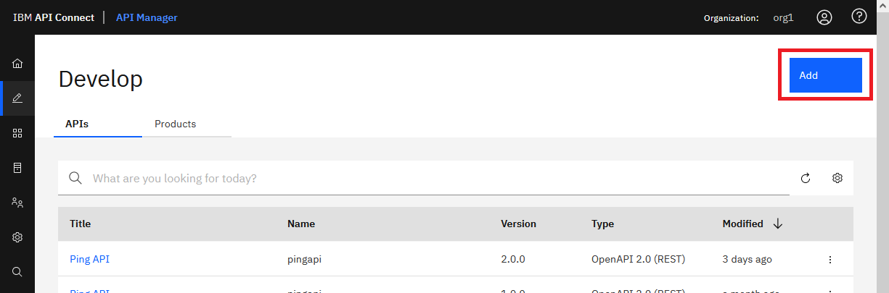

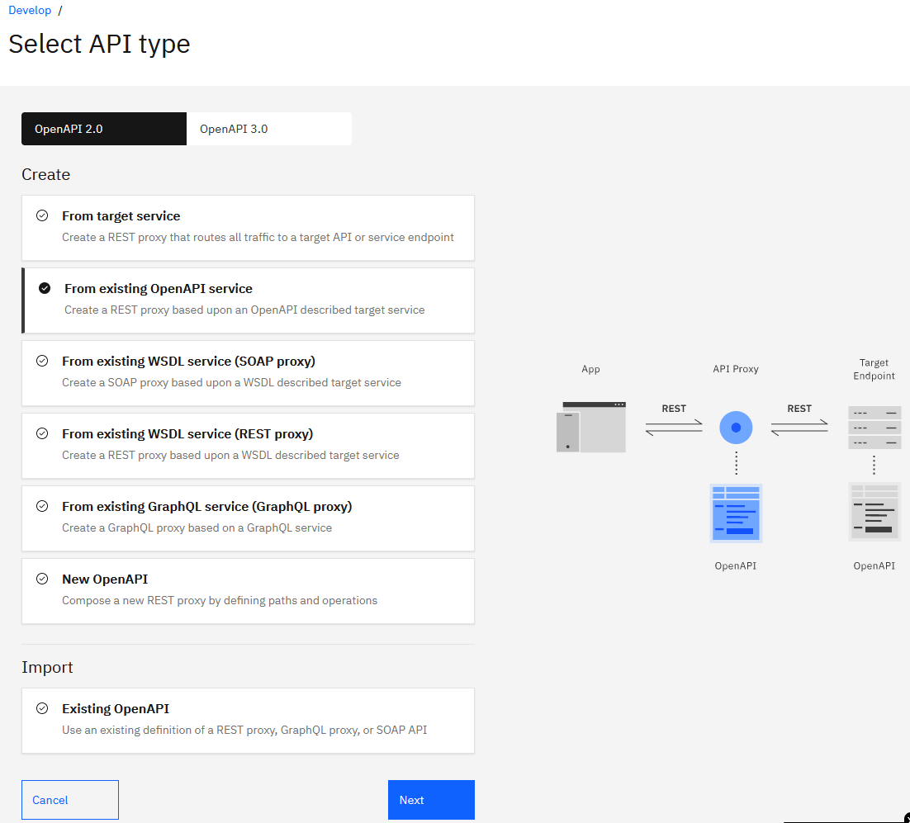

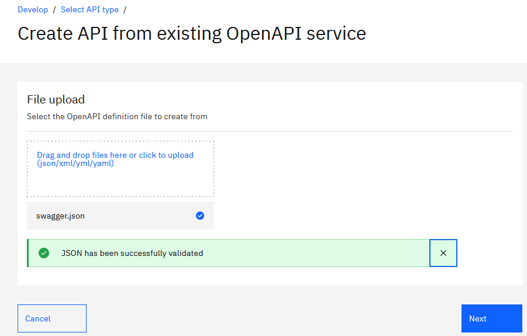

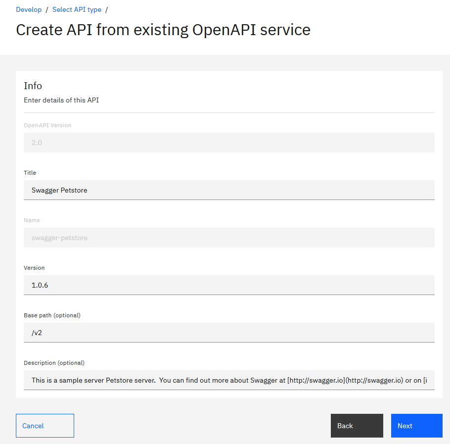

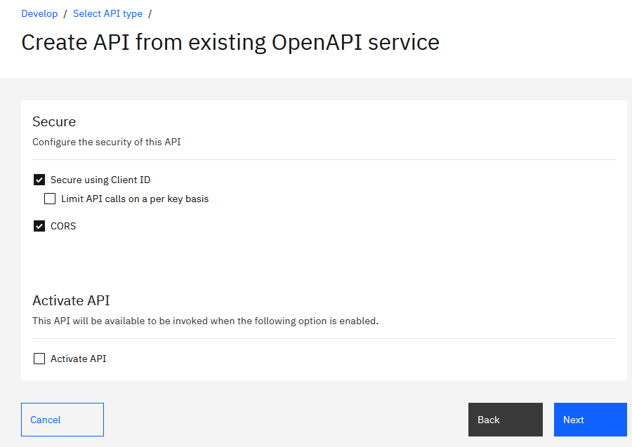

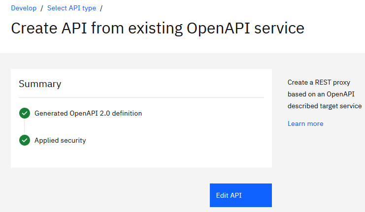

After clicking on the Validate button, we see that the API contains error.

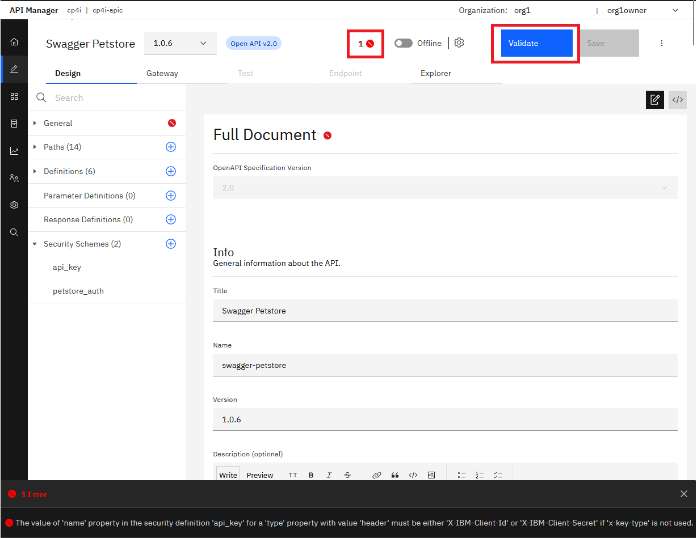

**Hint**: To track the changes I'm going to download the original API on the disk (to get it in yaml format).
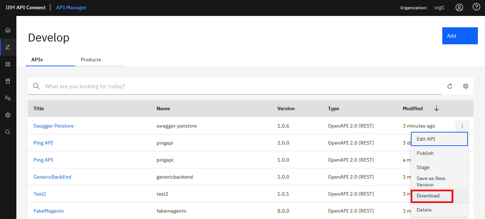

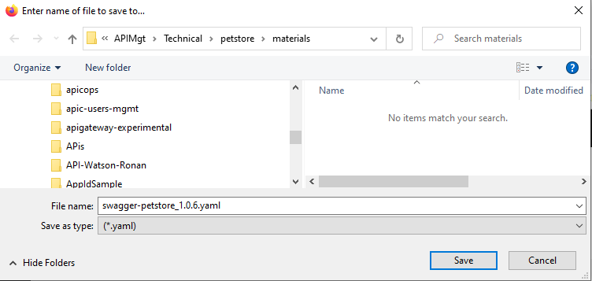

After slightly adapting the API everythings is working for more information see at the end the chapter explanations.
To facilitate the operation, I provide in this article the corrected API specifications (See original table at the top). So you can simply upload the corrected version and start ot use it.end

Below activating the "corrected" API.
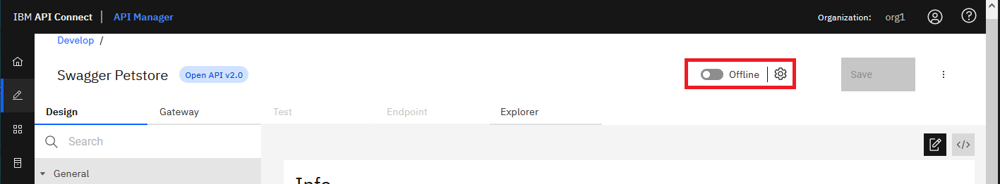
Then testing it
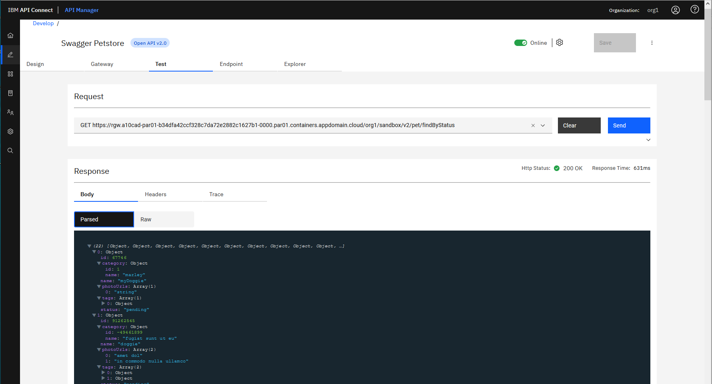

### Load from OAS 3

When using the Open API V3, the import of the API is slightly different as explained here.

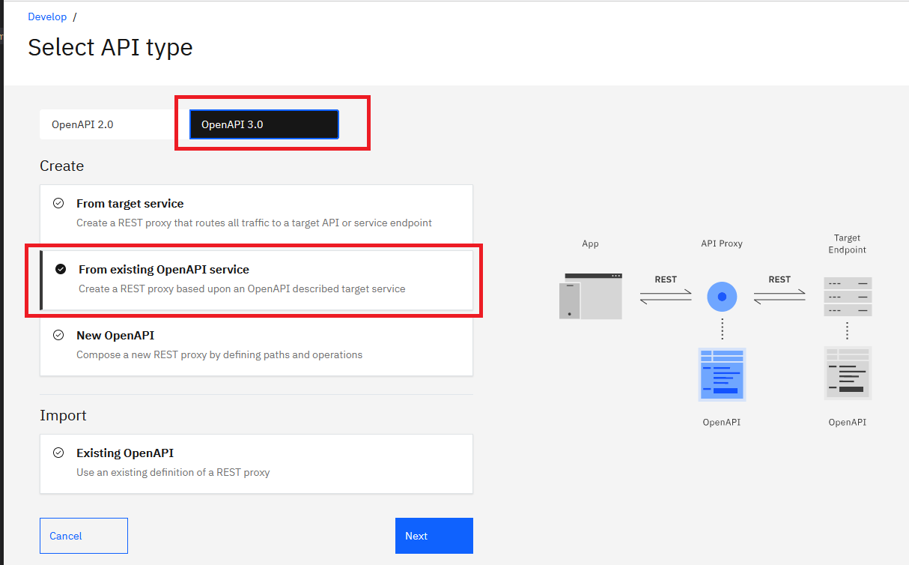

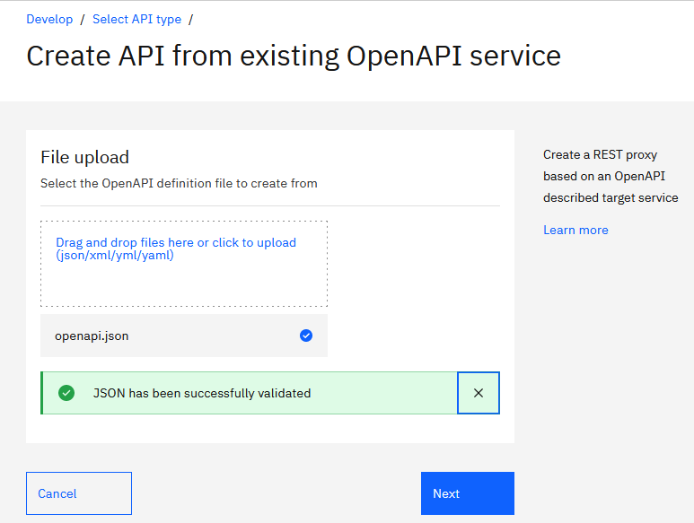

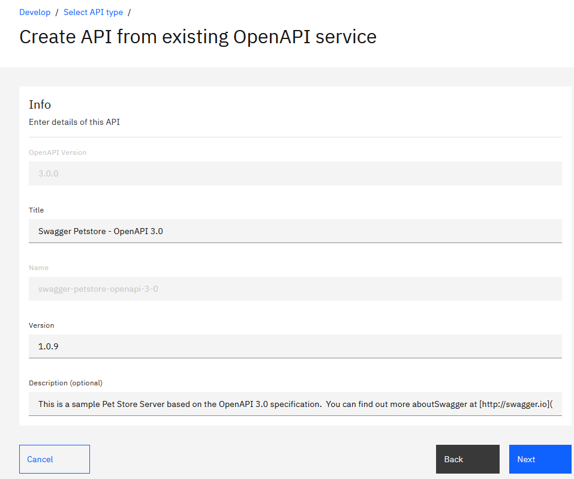

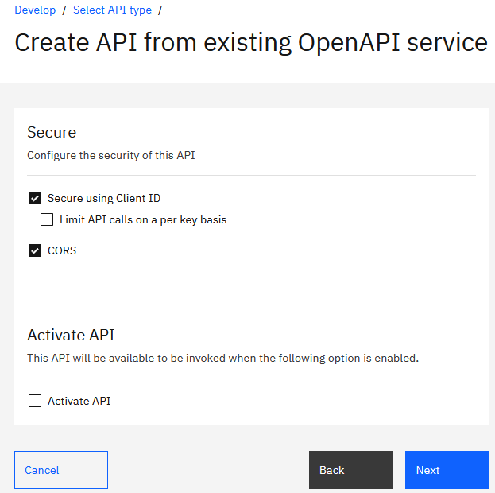

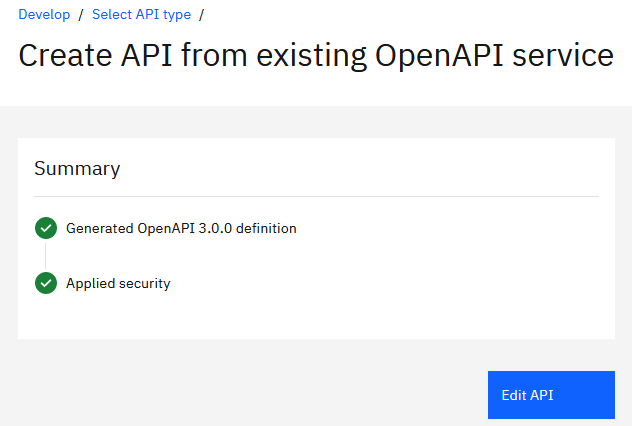

The API does not contain errors but we need to remove the oauth config.

## Explanations on fixing them

This chapter explains in more details the changes operated. You can also use the diff on the various yaml files located in materials directory.

### Changes

- Remove the security definition relating to oauth: petstore_auth
- For the Invoke, change the target-url to be target-url: $(target-url)$(request.path)$(request.search) instead of target-url: $(target-url)$(request.path)
- Change the security definition for API Key to be:

```yaml
securityDefinitions:
  api_key:
    type: apiKey
    x-key-type: client_id
    in: header
    name: X-IBM-Client-Id
```

- For 10.0.51.x, you have to change the "title": "Swagger Petstore - OpenAPI 3.0" to "title": "Swagger Petstore - OpenAPI 3-0" because . are not accpeted.

The corrected files are here:
|          | OAS2     | OAS3     |
|----------|----------|----------|
| 10.0.1.9 | [here](/materials/1001-final-swagger-petstore_1.0.6.yaml) | [here](/materials/1001-final-swagger-petstore-openapi-3-0_1.0.17.yaml) |
| 10.0.5.2 | [here](/materials/1005-final-swagger-petstore_1.0.6.yaml) | [here](/materials/1005-final-swagger-petstore-openapi-3.0_1.0.17.yaml) |

**Hint**: To get the API specification files after correction:

```bash
curl -LO https://github.com/ADesprets/petstore/blob/master/materials/1001-final-swagger-petstore-openapi-3-0_1.0.17.yaml
curl -LO https://github.com/ADesprets/petstore/blob/master/materials/1001-final-swagger-petstore_1.0.6.yaml
curl -LO https://github.com/ADesprets/petstore/blob/master/materials/1005-final-swagger-petstore-openapi-3.0_1.0.17.yaml
curl -LO https://github.com/ADesprets/petstore/blob/master/materials/1005-final-swagger-petstore_1.0.6.yaml
```
